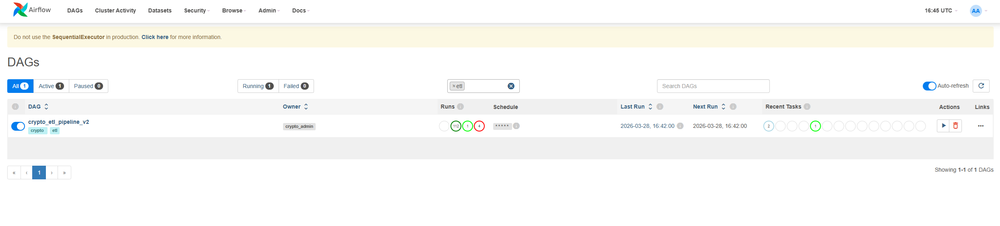
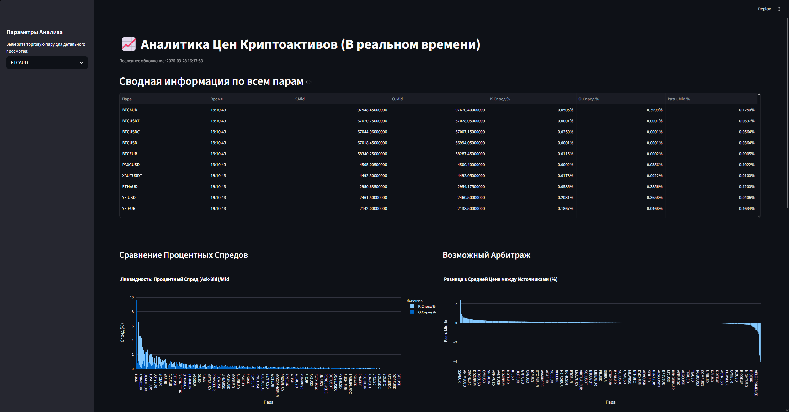
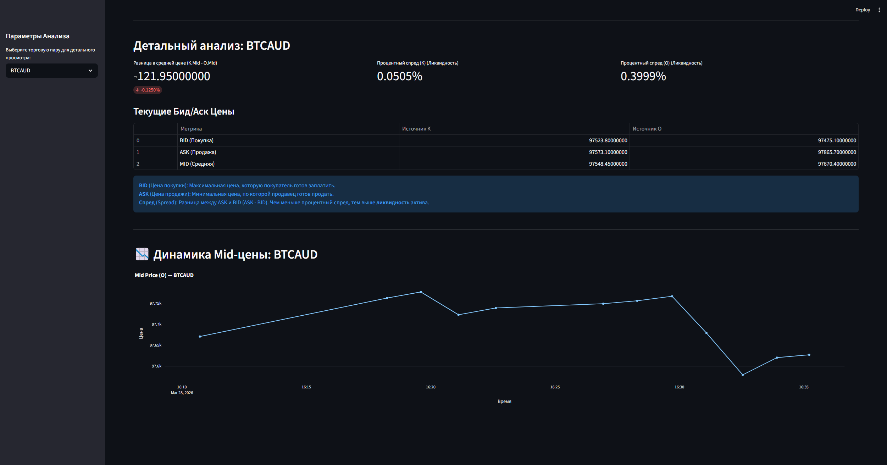

# Crypto ETL Collector & Analyser

Данный проект представляет собой автоматизированный конвейер извлечения, преобразования и загрузки данных (**ETL Pipeline**) для мониторинга криптовалютных котировок в реальном времени.

Каждую минуту фоновая система (балансировщик задач) обращается к API криптобирж **Kraken** и **OKX**, собирает данные книг ордеров (Bid, Ask), просчитывает среднюю цену (Mid-price), процентные спреды ликвидности и выявляет арбитражные "окна" между платформами. Очищенные (нормализованные) данные синхронизируются с реляционной базой **PostgreSQL**, избегая создания дубликатов благодаря `UPSERT` запросам.

Весь процесс циклично оркестрируется с помощью **Apache Airflow**, а для удобного графического мониторинга развернут интерактивный дашборд на **Streamlit**, обновляющий графики напрямую из БД. Вся инфраструктура полностью контейнеризирована через **Docker Compose**, что позволяет развернуть весь пайплайн одной командой.

## 🛠 Технологический стек
- **Python 3.12** — основной язык разработки
- **Apache Airflow 2.9 (Standalone)** — оркестрация и планирование задач (DAG)
- **PostgreSQL 15** — реляционное хранилище собранных данных
- **SQLAlchemy & pandas** — подключение к БД, очистка выбросов и агрегация
- **Streamlit & Plotly** — интерактивный BI-дашборд аналитики
- **Docker & Docker Compose** — контейнеризация всех компонентов в единую сеть

## 🏗 Архитектура проекта
Текущая архитектура построена на классическом паттерне трехуровневого ETL-пайплайна:
1. **Extract (`api.py`)** — загрузка необработанных JSON-данных через REST API Kraken и OKX.
2. **Transform (`normalizer.py`)** — нормализация тикеров (сведение `XXBTZUSD` к `BTCUSD`), выравнивание таймстемпов, вычисление Mid-price и спредов. Осуществляется фильтрация в pandas.
3. **Load (`storage.py`)** — операция `UPSERT` нормализованных исторических данных в базу PostgreSQL (таблица `prices`).

Визуализация реализована как независимый сервис, получающий обработанные данные из PostgreSQL для рендеринга графиков.

## 📂 Описание исходных файлов (Структура репозитория)
Каждый модуль выполняет строго одну функцию (Single Responsibility Principle):
* `api.py` — модуль сетевого взаимодействия. Содержит функции для отправки HTTP-запросов к биржам (Kraken, OKX), включая тайм-ауты и базовую обработку ошибок.
* `collector.py` — **основной модуль ETL процесса**. Содержит основные функции конвейера (`extract_raw_data`, `transform_data`, `load_to_postgres`), вызываемые Airflow по расписанию. Выполняет загрузку данных через API, очистку, объединение в датафрейм Pandas и отправку в хранилище.
* `normalizer.py` — модуль стандартизации тикеров. Конвертирует внутренние идентификаторы бирж (например `XXBT` на Kraken) в единый формат (`BTC`).
* `storage.py` — слой интеграции с базой данных (Load). Настраивает подключение через SQLAlchemy и выполняет SQL-запрос `UPSERT (ON CONFLICT)` для загрузки данных без дублирования записей.
* `config.py` — загрузчик конфигурации. Читает переменные окружения и настройки подключения к БД из системной среды (Docker), чтобы избежать хранения паролей в коде.
* `dags/crypto_dag.py` — описание DAG (Directed Acyclic Graph) для планировщика Airflow. Определяет последовательность шагов ETL, обрабатывает расписание и передает данные между тасками через механизм XCom.
* `streamlit_vizualization.py` — аналитический веб-интерфейс (Frontend). Автоматически подтягивает финансовые метрики из БД PostgreSQL каждые 30 секунд с применением математической очистки от выбросов (метод IQR, Z-Score).
* `docker-compose.yml` — конфигурация инфраструктуры: инициализирует три изолированных контейнера (PostgreSQL, Airflow, Streamlit) и связывает их внутренними сетями.
* `Dockerfile` — файл конфигурации для сборки образов Python и установки зависимостей системы.

## ✅ Реализованные критерии
* **Базовый ETL:** Логика строгих операций `extract_raw_data >> transform_data >> load_to_postgres`.
* **Airflow DAG:** Процесс забора полностью автоматизирован и оформлен в виде DAG с интервалом запуска 1 раз в минуту.
* **Обработка ошибок и Retries:** Вшитые тайм-ауты API-запросов (`raise_for_status()`) и автоматические перезапуски упавших тасок силами конфигурации Airflow (`retries: 2`).
* **Изоляция конфигурации:** Все параметры подключения к БД и инфраструктуре выведены в `docker-compose.yml` и обрабатываются модулем `config.py`. Код чист от захардкоженных паролей.

### 📸 Скриншоты проекта
**1. Панель управления (Оркестрация Airflow):**

**2. Аналитический дашборд (Streamlit):**

**3. Интерактивные графики (Streamlit):**


## 🚀 Как запустить проект локально

### 1. Требования
Для запуска на вашем компьютере должны быть установлены:
- [Docker Engine / Docker Desktop](https://docs.docker.com/get-docker/)
- [Docker Compose](https://docs.docker.com/compose/install/) (обычно идет в комплекте с Docker Desktop)

### 2. Установка и запуск
1. Склонируйте репозиторий:
   ```bash
   git clone https://github.com/NIvanisov/crypto_collector.git
   cd crypto_collector
   ```
2. Поднимите инфраструктуру одной командой. Docker сам соберет образы для Airflow и Streamlit (установит зависимости из `requirements.txt`), после чего запустит СУБД Postgres:
   ```bash
   docker-compose up -d --build
   ```

### 3. Использование
После того как контейнеры запустятся (обычно занимает около 1 минуты), сервисы станут доступны на вашем ПК:
- **Airflow Web UI:** перейдите по адресу http://localhost:8080
  * *Логин `admin` / Пароль `admin` (настройки по умолчанию из yml).*
  * *Включите ползунок у DAG `crypto_etl_pipeline_v2`, чтобы он начал собирать данные.*
- **Streamlit Визуализация:** перейдите по адресу http://localhost:8501
  * *Здесь будет доступен BI-дашборд (построится, как только DAG завершит первый оборот).*

### 4. Остановка работы
Чтобы завершить работу всех контенеров, выполните команду:
```bash
docker-compose down
```
*(PostgreSQL база данных сохранит собранные цены внутри Docker volume `pgdata`, поэтому при следующем запуске история цен не исчезнет).*
